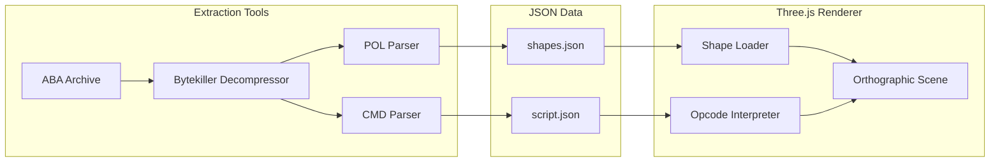

# Cutscene Data Extraction & Three.js Renderer

## Project Scope Change

Focus exclusively on the **polygon cutscene system**:

- Extract and parse CMD (commands) and POL (polygons) files
- Render cutscenes using Three.js with orthographic 2D
- Ignore: game engine, PGE system, sprites, levels, collision, audio (for now)

---

## Architecture



---

## Phase 1: Extraction Tools

### 1.1 Create tools directory structure

```
tools/
├── extract-cutscenes.py    # Main extraction script
├── bytekiller.py           # Decompression module  
├── parse_aba.py            # ABA archive reader
├── parse_pol.py            # POL file parser
├── parse_cmd.py            # CMD file parser
└── README.md               # Usage docs
```

### 1.2 Output JSON format

**shapes.json** (from POL):

```json
{
  "palettes": [[{"r":0,"g":0,"b":0}, ...]],
  "shapes": [{
    "id": 0,
    "primitives": [{
      "type": "polygon",
      "color": 14,
      "hasAlpha": false,
      "vertices": [[109,61], [131,46], ...]
    }]
  }]
}
```

**script.json** (from CMD):

```json
{
  "name": "LOGOS",
  "subscenes": [{
    "id": 0,
    "frames": [{
      "commands": [
        {"op": "drawShape", "shapeId": 5, "x": 0, "y": 0},
        {"op": "setPalette", "palNum": 0}
      ]
    }]
  }]
}
```

---

## Phase 2: Three.js Renderer

### 2.1 Project setup

```
/
├── src/
│   ├── main.ts
│   ├── CutscenePlayer.ts       # Main orchestrator
│   ├── ShapeRenderer.ts        # Polygon/ellipse/point drawing
│   ├── OpcodeInterpreter.ts    # CMD bytecode execution
│   └── types.ts                # TypeScript interfaces
├── public/
│   └── data/                   # Extracted JSON files
├── package.json
└── vite.config.ts
```

### 2.2 Rendering approach

- **Camera**: `OrthographicCamera` with viewport 256x224 (original resolution)
- **Shapes**: `THREE.Shape` + `ShapeGeometry` for polygons, `EllipseCurve` for ellipses
- **Colors**: `MeshBasicMaterial` with palette-indexed colors
- **Transformations**: `Object3D.matrix` for scale/rotate operations
- **Triple buffer**: Three render targets for front/back/aux pages

### 2.3 Opcode implementation priority

1. `drawShape` - Basic shape rendering
2. `setPalette` - Color changes
3. `markCurPos` / `updateScreen` - Frame timing
4. `drawShapeScale` - Zoom transformations
5. `drawShapeScaleRotate` - Full 3D rotation matrix

---

## Phase 3: Verification

### 3.1 Capture reference frames

1. Run REminiscence C++ engine with `--screenshot` or manual capture
2. Extract key frames from each cutscene (first frame, mid-point, transitions)
3. Save as PNG in `test/reference/`

### 3.2 Visual comparison

- Render same frame with Three.js
- Use pixel-diff tool (pixelmatch) to compare
- Accept < 5% pixel difference (anti-aliasing tolerance)

### 3.3 Test cutscenes (start simple)

1. **LOGOS** - Simple shapes, minimal animation (good first test)
2. **SCORE** - Tiny file (18 bytes CMD), verify edge cases
3. **DEBUT** - Medium complexity
4. **INTRO1** - Full complexity (57KB POL, many primitives)

---

## Deliverables

1. `tools/` - Python extraction scripts (reusable)
2. `/` - Three.js web app
3. `data/cutscenes/` - Extracted JSON files for each cutscene
4. `test/reference/` - Reference screenshots for verification
5. Updated `.cursor/rules/cutscene-system.mdc` with JSON schemas

---

## Questions Resolved

- Rendering: Orthographic 2D (closest to original)
- Verification: Visual comparison against reference screenshots
- Scope: Cutscenes only (no game engine, no audio yet)